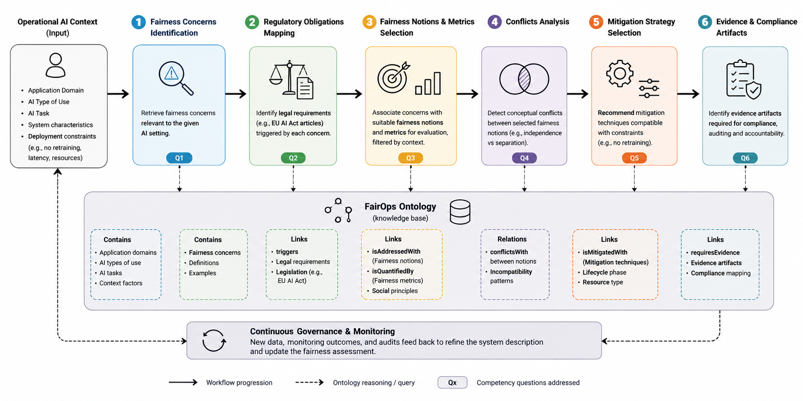

# `FairOps`
This ontology provides researchers, developers, and practitioners with a unified, machine-readable framework to guide the design and assessment of fair AI systems. FairOps is a comprehensive and extensible ontology for systematically modeling AI fairness notions, metrics, biases, evaluation methods, and their scientific provenance. On top of this, `FairOps` supports the governance workflow depicted in the following figure.

Starting from the operational AI context, the ontology incrementally derives fairness concerns, regulatory obligations, fairness notions and metrics, mitigation strategies, and compliance-oriented evidence artifacts while taking into account operational deployment constraints.

## Structure of the ontology code
The ontology code is divided into three Turtle files:

- `fairops.ttl` is the Turtle file of the ontology. It contains all the entities of the three different cores (Fairness core, AI context core, and Law core) and their relevant connections (object properties and annotation properties).
- `papers.ttl` provides all the references to the AI fairness literature. As `FairOps` maps all relevant fairness notions, metrics, and bias mitigation methods, this file contains over 3000 references.
- `indiv.ttl` contains the knowledge graph of the currently mapped individuals.

As an example, `Statistical Parity` is an individual of the class `Fairness Notion`. The taxonomy of fairness notions is described in the `fairops.ttl`, while the description of `Statistical Parity` is in `indiv.ttl`. The references to the literature contributions proposing and utilizing `Statistical Parity` and instead detailed in `papers.ttl`.

The `utilities` folder contains various python code and jupyter notebooks for the automated management of the ontology. In particular, `xing_fairness_experiment.py` validate the operational governance workflow enabled by `FairOps` by instantiating the ontology reasoning process on a publicly available dataset of a job recommendation platform: [XING recommendation dataset](https://github.com/MilkaLichtblau/xing_dataset/). 
